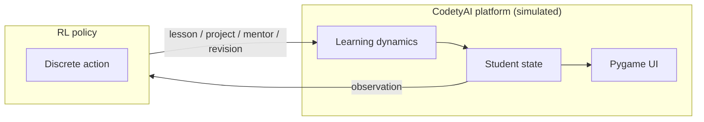

# Adaptive AI Learning & Mentorship Optimization (CodetyAI RL)

**Mission alignment:** This reinforcement-learning prototype simulates how **CodetyAI** could sequence **lessons, projects, mentor connections, and revision** for university STEM learners in Rwanda—maximizing skill growth, confidence, and job-readiness (reducing youth unemployment through industry-aligned AI training).

**Course summative:** custom Gymnasium environment (**AI training platform simulation**) with **Pygame** UI, four algorithms (**DQN, REINFORCE, PPO, A2C**) via Stable-Baselines3 + PyTorch REINFORCE, **10 hyperparameter runs per algorithm**, and shared evaluation scripts.

**GitHub:** [https://github.com/thepatrickniyo/patrick-niyogitare_rl_summative](https://github.com/thepatrickniyo/patrick-niyogitare_rl_summative)

## Project layout

```text
project_root/
├── environment/
│   ├── custom_env.py       # CodetyAILearningEnv
│   ├── rendering.py        # Pygame: bars, actions, skill curve
├── training/
│   ├── dqn_training.py
│   ├── pg_training.py      # PPO, A2C, REINFORCE
│   ├── hyperparam_runs.py
├── models/dqn/  models/pg/{ppo,a2c,reinforce}/
├── demos/record_random_rollout.py
├── scripts/
├── main.py
├── requirements.txt
└── README.md
```

## Agent ↔ platform (diagram)

The policy observes a **single simulated student** (skill, engagement, projects, mentorship, confidence, time in program) and chooses the next **pedagogical action**. The environment updates learning outcomes stochastically; Pygame shows progress bars, last action label, and skill-over-time.



## Actions (exhaustive, discrete)

| ID | Action |
|----|--------|
| 0 | Assign **beginner** lesson |
| 1 | Assign **advanced** lesson |
| 2 | Assign **hands-on project** |
| 3 | **Connect mentor** |
| 4 | **Recommend revision** |

## Observation & reward (summary)

- **Vector (6 dims, normalized):** skill, engagement, completed projects, mentorship count, confidence, program progress.
- **Rewards:** +10 project completion, +15 strong skill gain in one step (≥3 points), +20 **job-ready** (skill ≥75, confidence ≥70, ≥2 projects), −10 engagement drop, −20 **dropout**.
- **Terminal:** job-ready **success**, dropout **failure**, or max steps.

Details: `environment/custom_env.py`.

## Setup

```bash
python3 -m venv .venv && source .venv/bin/activate
pip install -r requirements.txt
export PYTHONPATH=.
```

Headless GIF capture: `export SDL_VIDEODRIVER=dummy` if Pygame cannot open a window.

## Random policy GIF (no training)

```bash
PYTHONPATH=. python demos/record_random_rollout.py --out static/random_agent_rollout.gif
```

## Training (same environment for all algorithms)

```bash
PYTHONPATH=. python training/dqn_training.py --run_index 0 --timesteps 100000
PYTHONPATH=. python training/pg_training.py --algo ppo --run_index 0 --timesteps 120000
PYTHONPATH=. python training/pg_training.py --algo a2c --run_index 0 --timesteps 120000
PYTHONPATH=. python training/pg_training.py --algo reinforce --run_index 0 --episodes 2500
```

Full sweep (40 jobs): `PYTHONPATH=. python scripts/run_hyperparameter_sweep.py`

Best checkpoints: `PYTHONPATH=. python scripts/select_best_models.py` → `results/best_models.json`

> **Note:** Observation size changed from any earlier traffic prototype—**retrain** models after pulling this mission version.

## Evaluate best agent + GUI (“game” demo window)

The Pygame window is the **live demo**: progress bars, last action, skill curve, status badge, and optional **on-screen objective + reward legend** (for your screen recording).

```bash
# Best for the assignment video: GUI + verbose terminal + checklist overlay
PYTHONPATH=. python main.py --algo dqn --model-path models/dqn/run_0.zip --render --demo --verbose --episodes 1
```

**Episode feels too short?** Success (`job-ready`) or **dropout** ends the episode early. To make the demo **run longer on screen**:

- **`--max-steps 500`** — allow up to 500 steps before timeout (default cap is 200).
- **`--step-delay 0.06`** — pause ~60 ms after each frame so the GUI is easier to follow on video.
- **`--stricter-job-ready`** — raises the bar for success so “job-ready” happens later (policy was trained on default thresholds; this mode is mainly for **visualisation**).

Example longer, slower demo:

```bash
PYTHONPATH=. python main.py --algo dqn --model-path models/dqn/run_0.zip \
  --render --demo --verbose --episodes 1 --max-steps 500 --step-delay 0.05
```

If you use `results/best_models.json`, omit `--model-path` and pass `--algo` to match.

### Video recording checklist (typical course rubric)

| Requirement | What to do |
|-------------|------------|
| Full screen + camera | Share entire desktop; face camera on; place terminal next to the Pygame window (or split-screen). |
| State the problem | Briefly describe youth STEM employability + CodetyAI (Rwanda / Africa context). |
| Agent behaviour | Explain that the policy chooses **lesson / project / mentor / revision** each step from the student state. |
| Reward structure | Use **--demo** so rewards are visible on screen, or read the legend in `custom_env.py`. |
| Objective | **Maximize cumulative reward** → skill, confidence, projects → **job-ready** (success). |
| Run best agent | **--render --verbose**; show **both** the Pygame GUI and terminal **step logs**. |
| Explain performance | Comment on return, job-ready vs dropout, skill curve at end of episode. |

The GUI updates **every step** while `--render` is on (not only at the end).

## Algorithms

| Algorithm | Role |
|-----------|------|
| **DQN** | Value-based discrete control |
| **REINFORCE** | Monte Carlo policy gradient (custom) |
| **PPO** | Stable policy improvement |
| **A2C** | Actor–critic (advantage + value head) |

Hyperparameter grids: `training/hyperparam_runs.py`.

## Report & video

- **PDF:** follow your course template; outline in `report/REPORT_STRUCTURE.md`.
- **Video:** see **Video recording checklist** above; use `--render --demo --verbose` for the clearest demo.

## Licence

Educational use (RL summative).
